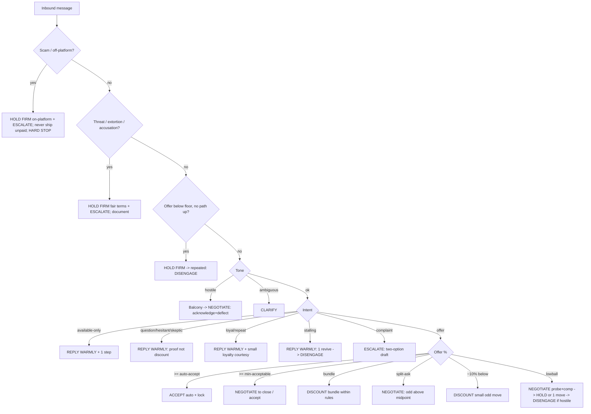

# Section 4 — Agent decision framework

The decision logic the copilot runs **on every inbound buyer message**. Section 3 describes the playbook by lifecycle stage; this section is the runtime: the branching tree, the signals each branch reads, the seller-set constraints it depends on, what is automated vs. suggested-only, and the guardrails that force escalation.

**Terminal actions (the only outputs):**

| Action | Meaning |
|--------|---------|
| **reply warmly** | Low-friction informational/relationship reply (availability, loyalty, easy yes) |
| **clarify** | Ambiguous/terse/low-signal message → neutral clarifier before committing |
| **negotiate** | Run the Stage-3 offer/counter loop (probe, justify, conditional move) |
| **hold firm** | Restate the fair offer / decline a cut without conceding |
| **discount** | Make a concession (move price/terms) — *gated; see automation table* |
| **escalate-to-seller** | Hand the thread to the human with context and a drafted option |
| **disengage** | Stop responding (leave standing offer, relist) / politely end |

Cited assets: **PRIN-xxx** principles, **INTENT-xxx** intents, **OBJ-xxx** objections, **CONC-xxx** concessions, **COACH-xxx** coaching. Books: NSD, GTY, GPN, BFA, 3DN, INF, DC (see Section 3 key).

---

## Inputs / signals read on every message

| Signal | Source | Used by branches |
|--------|--------|------------------|
| **INTENT** (INTENT-001…014) | Buyer-intent classifier on message text + history | All |
| **Offer %** = offer ÷ ask | Best-Offer button / parsed message | negotiate, discount, hold firm |
| **Tone** (warm / neutral / hostile / ambiguous) | Sentiment + COACH-008 ambiguity check | clarify, hold firm, escalate, disengage |
| **Scam flags** | Off-platform / ship-first / overpayment / fake-screenshot detectors (INTENT-009) | escalate, hard-stop |
| **Threat / accusation flags** | Review-extortion, "or else," fraud accusation (INTENT-008/013) | escalate, hold firm |
| **Seller constraints** | Floor, min-acceptable, auto-accept threshold, bundle rules, will-ship/returns | discount, negotiate, hold firm |
| **Listing context** | Saves/watchers, days-on-market, parallel offers, BATNA | hold-vs-concede, scarcity |
| **Relationship** | Repeat buyer / follower / local (INTENT-011) | reply warmly, discount |
| **History** | Rounds so far, prior nibbles, seller draft edits | disengage, hold firm |

---

## Required seller-set constraints

The framework cannot run without these. Captured at listing time (Stage 1) and editable per item; defaults synthesized but seller overrides win.

| Constraint | What it is | Default behavior | Drives |
|------------|------------|------------------|--------|
| **Floor price** | True walk-away = relist/hold value (BATNA), PRIN-010 | Computed from comp range bottom; seller confirms | Hard cap on all discounts; below-floor → escalate |
| **Min acceptable** | Lowest the copilot may accept without asking | = floor unless seller sets higher | hold-vs-concede boundary |
| **Auto-accept threshold** | Offer % at/above which an offer is auto-accepted | Off by default; seller opts in (e.g. ≥95% of ask) | Only fully-automated accept |
| **Goal price** | Anchor target (top of comp range), PRIN-009 | Top of comp range | Counter target; floor-leak nudge (COACH-002) |
| **Bundle rules** | Eligible items, max blended % off, combined-shipping rule | ~10–20% off singles (CONC-006); seller caps | Bundle (discount) branch |
| **Will-ship / returns** | Ships? where? return policy? | Per listing | Logistics, OBJ-shipping-cost / OBJ-condition-doubt, dispute options |
| **Concession ceiling** | Max % off list the copilot may *suggest* without confirm | ~10% on first move (CONC-001) | discount gating |
| **Markdown cadence** | Relist/step-down schedule, PRIN-038 | −10% per 7–10 days | aging-listing flex (CONC-008) |

---

## The decision tree

Evaluated **top to bottom; first match wins.** Guardrail layer (Step 0) runs before any negotiation logic — a scam/threat short-circuits everything.

```
ON each inbound buyer message:

STEP 0 — SAFETY GUARDRAILS (hard, pre-empt all else)
├─ Scam flag? (off-platform pay / ship-first / overpayment / fake "payment sent")  [INTENT-009]
│     → HOLD FIRM on-platform + ESCALATE-TO-SELLER
│       · decline on principle (PRIN-044, OBJ-off-platform-request, CONC-012)
│       · NEVER ship before confirmed on-platform payment
│       · if pressed → DISENGAGE + report + block   [HARD STOP — never negotiate]
├─ Threat / review-extortion / "or else"?  [INTENT-008]
│     → HOLD FIRM (fair terms only, 0% to pressure, CONC-010) + ESCALATE-TO-SELLER
│       · document thread (PRIN-040, COACH-018); never reward the threat
├─ Fraud / bad-intent accusation (pre- or post-sale)?  [INTENT-012 / INTENT-013]
│     → ESCALATE-TO-SELLER with impact-not-intent draft
│       · acknowledge feeling, set intent aside, invite proof (PRIN-041, COACH-016)
└─ Offer strictly BELOW floor with no path up?  
      → HOLD FIRM (restate fair offer) → if repeated/hostile, DISENGAGE
        · never auto-accept or auto-discount below floor (PRIN-010, COACH-001)

STEP 1 — TONE / READABILITY GATE  (COACH-008: don't react instantly)
├─ Hostile tone?  [INTENT-007]
│     → go to BALCONY (cool-down/draft, PRIN-019); then NEGOTIATE via
│       acknowledge→deflect (PRIN-020, PRIN-021); never counter-punch (COACH-009)
├─ Ambiguous / terse / unreadable?  [INTENT-014]
│     → CLARIFY with a neutral question (PRIN-012); assume nothing (COACH-008)
└─ else → continue

STEP 2 — INTENT ROUTING (non-offer messages)
├─ "Is it available?" only  [INTENT-010]
│     → REPLY WARMLY + one forward step (PRIN-039, PRIN-032); low signal, don't pitch
├─ Question / hesitant / skeptic  [INTENT-001/004/012]
│     → REPLY WARMLY with proof, NOT discount (PRIN-030, PRIN-013, PRIN-036, COACH-007)
│       · ladder small yeses toward purchase (PRIN-032)
├─ Repeat / loyal / local  [INTENT-011]
│     → REPLY WARMLY; may DISCOUNT a small loyalty courtesy (CONC-009, PRIN-027)
├─ Stalling / ghosting  [INTENT-005]
│     → REPLY WARMLY: one 'No'-oriented revive, keep offer visible (PRIN-015, PRIN-023)
│       · max ONE nudge (COACH-014); then DISENGAGE/relist
└─ Post-sale complaint (not accusation)  [INTENT-013]
      → ESCALATE-TO-SELLER with two-option draft (PRIN-043, PRIN-020, PRIN-042, COACH-015)

STEP 3 — OFFER PRESENT → evaluate offer %  (gated by floor/min/auto-accept)
├─ offer % ≥ AUTO-ACCEPT threshold (seller opt-in)?
│     → ACCEPT (the ONE fully-automated terminal) → lock on-platform (PRIN-025)
├─ offer % ≥ MIN-ACCEPTABLE (clears goal/floor)?
│     → NEGOTIATE-to-close: accept or one small odd move (CONC-002); be generous (PRIN-024)
├─ bundle / multi-item interest?  [INTENT-006]
│     → DISCOUNT(bundle): northeast move within bundle rules (CONC-006, PRIN-006) [confirm if > ceiling]
├─ "split the difference" ask?
│     → NEGOTIATE: counter odd above midpoint; split only inside comps (CONC-004, PRIN-008)
├─ reasonable (~10% below)?  [near goal]
│     → DISCOUNT(small): odd-number move inside comp range (CONC-002, PRIN-017)
├─ lowball (<50–60% of ask)?  [INTENT-002]
│     → NEGOTIATE first: probe + comp-justify (PRIN-002, PRIN-004, PRIN-003)
│       · then HOLD FIRM or ONE conditional move near list (CONC-001); never reflex-split (PRIN-008)
│       · repeated + hostile after 2 rounds → DISENGAGE (leave standing offer, relist)
└─ aging listing / lone buyer / weak BATNA?  [CONC-008]
      → DISCOUNT(flex) toward true floor via markdown ladder; still extract a reciprocal move

STEP 4 — OBJECTION OVERLAY (applied within negotiate/hold)
│  Map the stated objection to its OBJ handler and pick warm/firm/data-backed variant:
│  price-too-high · competitor-cheaper · condition-doubt · shipping-cost ·
│  wants-bundle-deal · trust-authenticity   (full handlers in Section 3)
```

### Mermaid view



---

## Automated vs. suggested-only

The hard rule: **the copilot can give the seller money/protection back automatically, but never give it away automatically, and never end a relationship automatically.**

| Behavior | Mode | Why |
|----------|------|-----|
| Accept offer **≥ auto-accept threshold** | **AUTOMATED** | Seller pre-authorized; strictly above floor (COACH-001) |
| Send confirmation / lock the agreed offer on-platform | **AUTOMATED** | Captures commitment, no value given away (PRIN-25, COACH-003) |
| Classify intent, draft replies, surface the recommended play | **AUTOMATED** (drafting) | Drafts only; send-step gated below |
| Balcony / cool-down on hostile or angry-seller drafts | **AUTOMATED guardrail** | Prevents irreversible harm (COACH-008/009/010) |
| Block fabricated scarcity / fake comps / unbacked authenticity | **AUTOMATED guardrail (hard-block)** | Ethics + platform safety (COACH-013) |
| Decline off-platform + refuse ship-before-pay | **AUTOMATED guardrail** | Safety override, non-negotiable (PRIN-044) |
| Limit to ONE scarcity note / ONE re-engage nudge | **AUTOMATED guardrail** | Anti-reactance (COACH-014) |
| **Make any discount / price-or-term concession** | **SUGGESTED — needs seller confirm** | Never auto-give margin (esp. > concession ceiling) |
| Counter-offer below goal (toward floor) | **SUGGESTED — confirm** | Floor-leak risk (COACH-002) |
| Bundle discount beyond bundle rules ceiling | **SUGGESTED — confirm** | Margin protection (CONC-006) |
| Accept an offer **below** auto-accept but above min | **SUGGESTED — confirm** | Judgment call near goal |
| **Disengage / let a deal die / relist** | **SUGGESTED — confirm** | Never auto-end a live relationship |
| Escalate-to-seller (scam, threat, accusation, complaint, below-floor) | **AUTOMATED routing** + seller decides | Copilot routes; human owns the call |
| Issue any refund / accept a return | **SUGGESTED — confirm** | Money out; human approves (CONC-011) |

**One-line policy:** *auto-accept above the floor; auto-lock the written deal; auto-block scams and fabrications — but never auto-discount, auto-disengage, or auto-refund without seller confirmation.*

---

## Escalation guardrails (force hand-off to seller)

These conditions **override** the normal flow and route to **escalate-to-seller** (and, where noted, hard-stop). The copilot still drafts a recommended reply, but does not send a negotiation move.

| Trigger | Signal | Forced action | Refs |
|---------|--------|---------------|------|
| **Off-platform / scam request** | "pay outside app," ship-first, overpayment-refund, unverifiable "payment sent" screenshot (INTENT-009) | Hold on-platform + escalate; **never ship unpaid**; disengage+report if pressed | PRIN-044, OBJ-off-platform-request, CONC-012 |
| **Accusation of bad intent** | "you knew it was fake," "you scammed me" (INTENT-012/013) | Escalate with impact-not-intent draft; no defensive denial | PRIN-041, COACH-016 |
| **Dispute / return / refund** | "not as described," "arrived damaged," "I want a refund" (INTENT-013) | Escalate with two-option fair-standard draft; no panic refund, no stonewall | PRIN-043, CONC-011, COACH-015/024 |
| **Price below floor** | Offer (or demanded cut) below seller's floor/min with no path up | Hold firm; escalate before any sub-floor move; repeated → suggest disengage | PRIN-010, COACH-001 |
| **Threat / extortion** | "discount or one-star," "or else," serial nibbles (INTENT-008) | Hold fair terms (0% to pressure), document, escalate | PRIN-040, CONC-010, COACH-018 |
| **Concession beyond ceiling** | Any suggested discount > seller's concession/bundle ceiling | Require explicit seller confirm | CONC-001/006, COACH-002 |
| **Repeated hostility after fair offer** | 2+ hostile rounds post fair offer (INTENT-007) | Name dynamic once, hold offer, suggest disengage+report | OBJ-rude-aggressive, COACH-009 |

---

## Decision-logic gaps & open questions

These are points where the books/assets give logic but not parameters, or where marketplace-data features are required that the source material does not supply (flagged in the assets' own notes):

1. **Marketplace-data signals are external.** Like/save counts, days-on-market, repeat-buyer status, parallel-offer state, and off-platform payment patterns are platform-data features the books do not provide (per the intent-classifier note). The framework reads them but their thresholds (e.g. "active watchers" = how many?) must be defined in product, not derived from the books.
2. **Auto-accept threshold is unset by default.** No source gives a number; the copilot ships it **off** and requires opt-in. Needs a recommended starting value (proposed ≥95% of ask) validated against real conversion data via the Stage-5 loop.
3. **Floor vs. min-acceptable can collapse.** When a seller sets only a floor, min-acceptable defaults to it — removing the "negotiate-to-close above min" band. Product needs to decide whether to prompt for a distinct min or infer one from the goal/floor spread.
4. **Concession-percentage defaults are synthesized, not sourced.** The CONC max-discount figures (0–10%, 10–20%, etc.) are defaults for casual resale; the books give *logic, not percentages* (per the concession-table note). They assume comp-supported list prices and must be tuned per category by the learning loop.
5. **Intent classification confidence threshold.** The tree assumes a single best-match intent; it does not specify what happens at low classifier confidence between, say, INTENT-002 (lowball) and INTENT-007 (rude). Current fallback is the tone gate (Step 1) → clarify, but a confidence cutoff should be set explicitly.
6. **Ambiguous-vs-hostile boundary.** INTENT-007 (rude) and INTENT-014 (ambiguous) both route through Step 1; the line between "terse but neutral" and "hostile" is a sentiment-model judgment with real cost if misread (COACH-008). Needs a calibrated, conservative bias toward *clarify*.
7. **Parallel-buyer / hold orchestration.** COACH-022 says keep buyers parallel and avoid unpaid holds, but the framework processes one thread per message and has no cross-thread arbitration (e.g. two buyers at min-acceptable simultaneously). Multi-thread "first firm commitment wins" logic is unspecified.
8. **Scam detection is signal-list-based, not ML-verified.** INTENT-009 relies on keyword/pattern flags; a sophisticated scammer who avoids trigger phrases until after agreement isn't caught pre-emptively. The "never ship before confirmed on-platform payment" guardrail is the backstop, but fake-screenshot verification is left to the human.
