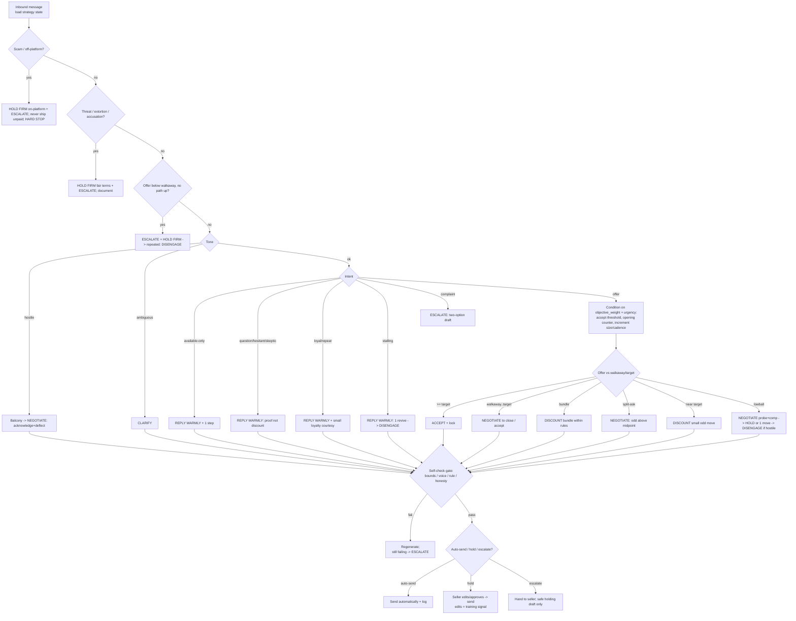

# Section 4 — Agent decision framework

## Changelog (v2)

Conforms to **CONVENTIONS.md (v2)**. Changes from v1:
- **Three-price model** (CONVENTIONS §A): seller constraints are now `list_price` / `target_price` / `walkaway_price` with the invariant `walkaway ≤ target ≤ list`. Replaces the old single-`floor` + `min-acceptable` framing.
- **Hybrid autonomy is the chosen model** (CONVENTIONS §B): the AUTOMATED-vs-SUGGESTED section is now an authoritative AUTO-SEND / HOLD-FOR-APPROVAL / ESCALATE tier table. Seller edits to held drafts are the primary training signal.
- **Objective/urgency drive the branches** (CONVENTIONS §E): offer-evaluation and concession aggressiveness now read `objective_weight` + `urgency` (opening counter, increment size/cadence, accept threshold). Decision tree (ASCII + Mermaid) updated with the objective/urgency-conditioned concession step and auto-send/hold/escalate routing.
- **Conversation-level strategy state** (CONVENTIONS §D, loop steps 1–3): intent + chosen strategy + concession-steps-used + intent-confidence persist across turns; strategy is not re-rolled per message.
- **Self-check gate** (CONVENTIONS §D step 5): pre-send gate (bounds/voice/rule/honesty) on every draft, BEFORE auto-send-or-hold routing; failing forces regenerate-or-escalate.
- **Decision-logic gaps** updated: auto-accept threshold (now objective-driven) and floor-vs-min-acceptable (now three-price) marked resolved; genuinely-open items retained.

---

The decision logic the copilot runs **on every inbound buyer message**. Section 3 describes the playbook by lifecycle stage; this section is the runtime: the branching tree, the signals each branch reads, the seller-set constraints it depends on, what is automated vs. suggested-only, and the guardrails that force escalation.

**Terminal actions (the only outputs):**

| Action | Meaning |
|--------|---------|
| **reply warmly** | Low-friction informational/relationship reply (availability, loyalty, easy yes) |
| **clarify** | Ambiguous/terse/low-signal message → neutral clarifier before committing |
| **negotiate** | Run the Stage-3 offer/counter loop (probe, justify, conditional move) |
| **hold firm** | Restate the fair offer / decline a cut without conceding |
| **discount** | Make a concession (move price/terms) — *gated; see automation table* |
| **escalate-to-seller** | Hand the thread to the human with context and a drafted option |
| **disengage** | Stop responding (leave standing offer, relist) / politely end |

Cited assets: **PRIN-xxx** principles, **INTENT-xxx** intents, **OBJ-xxx** objections, **CONC-xxx** concessions, **COACH-xxx** coaching. Books: NSD, GTY, GPN, BFA, 3DN, INF, DC (see Section 3 key).

---

## Inputs / signals read on every message

| Signal | Source | Used by branches |
|--------|--------|------------------|
| **INTENT** (INTENT-001…014) | Buyer-intent classifier on message text + history | All |
| **Offer %** = offer ÷ ask | Best-Offer button / parsed message | negotiate, discount, hold firm |
| **Tone** (warm / neutral / hostile / ambiguous) | Sentiment + COACH-008 ambiguity check | clarify, hold firm, escalate, disengage |
| **Scam flags** | Off-platform / ship-first / overpayment / fake-screenshot detectors (INTENT-009) | escalate, hard-stop |
| **Threat / accusation flags** | Review-extortion, "or else," fraud accusation (INTENT-008/013) | escalate, hold firm |
| **Seller constraints** | list_price / target_price / walkaway_price, urgency, objective_weight, ship/returns, condition_notes (CONVENTIONS §A) | discount, negotiate, hold firm |
| **Objective / urgency** | `objective_weight` (price↔speed), `urgency` (gone_today / this_week / no_rush) | negotiate, discount (concession aggressiveness, accept threshold) — §E |
| **Listing context** | Saves/watchers, days-on-market, parallel offers, BATNA | hold-vs-concede, scarcity |
| **Relationship** | Repeat buyer / follower / local (INTENT-011) | reply warmly, discount |
| **History** | Rounds so far, prior nibbles, seller draft edits | disengage, hold firm |

---

## Required seller-set constraints

The framework cannot run without these. Captured at the listing-review step (Stage 1, CONVENTIONS §A) and editable per item; defaults synthesized from comps but seller overrides win. Nothing posts until the seller approves.

Uses the **three-price model** (CONVENTIONS §A): a public anchor, an ideal target, and a hard reservation. **Invariant the AI enforces: `walkaway_price ≤ target_price ≤ list_price`.** If `list = target`, warn — the seller has pre-conceded the entire range (anchoring, PRIN-009).

| Constraint | What it is | Default behavior | Drives |
|------------|------------|------------------|--------|
| **`list_price`** | Public anchor; set high-but-justifiable (PRIN-009) | AI proposes from comp-range top; seller approves | Anchor; opening-counter target when price-weighted |
| **`target_price`** | Ideal outcome the AI steers toward | AI proposes inside comp range; seller approves | Accept threshold (price-weighted); counter target when speed-weighted |
| **`walkaway_price`** | Reservation / floor (BATNA, PRIN-010). **AI never goes below — hard bound.** | Computed from comp-range bottom; seller confirms | Hard cap on all discounts; offer below → ESCALATE |
| **`urgency`** | `gone_today` \| `this_week` \| `no_rush` | Seller sets | Concession cadence, relist/price-drop speed (§E) |
| **`objective_weight`** | Price ↔ Speed slider (0 = fastest sale … 100 = max price) | Seller sets | Opening counter, increment size/cadence, accept threshold (§E) |
| **`will_ship` / `ship_pays` / `returns`** | Logistics | Per listing | Logistics, OBJ-shipping-cost / OBJ-condition-doubt, dispute options |
| **`bundle_ok` + rules** | Eligible items, max blended % off, combined-shipping rule | ~10–20% off singles (CONC-006); seller caps | Bundle (discount) branch |
| **`condition_notes`** | Known flaws for honest disclosure | Seller supplies | Accusation-audit / trust plays; honesty gate (step 5) |

**Concession aggressiveness, opening-counter position, and accept threshold are no longer fixed constraints — they are *derived* from `objective_weight` + `urgency` per CONVENTIONS §E** (see the decision tree's concession step). CONC-xxx percentages remain synthesized defaults tuned by the learning loop.

---

## Conversation-level strategy state (persisted across turns)

The first three loop steps (CONVENTIONS §D) are **held as conversation state, not recomputed per message**: `intent`, the **chosen strategy** (selected PRIN-xxx + CONC-xxx plan), **concession-steps-used**, and **intent-confidence**. The tree below reads and updates this state; it does **not re-roll the strategy every message**. Intent/confidence are refreshed when the buyer's behavior contradicts the prior read; the concession plan advances along its ladder rather than resetting.

## The decision tree

Evaluated **top to bottom; first match wins.** Guardrail layer (Step 0) runs before any negotiation logic — a scam/threat short-circuits everything. After a terminal action produces a draft, the **self-check gate (Step 5)** runs, then the **auto-send / hold / escalate routing (Step 6)** decides whether it sends.

```
ON each inbound buyer message:
  (load conversation strategy state: intent, chosen strategy, concession-steps-used, intent-confidence)

STEP 0 — SAFETY GUARDRAILS (hard, pre-empt all else)
├─ Scam flag? (off-platform pay / ship-first / overpayment / fake "payment sent")  [INTENT-009]
│     → HOLD FIRM on-platform + ESCALATE-TO-SELLER
│       · decline on principle (PRIN-044, OBJ-off-platform-request, CONC-012)
│       · NEVER ship before confirmed on-platform payment
│       · if pressed → DISENGAGE + report + block   [HARD STOP — never negotiate]
├─ Threat / review-extortion / "or else"?  [INTENT-008]
│     → HOLD FIRM (fair terms only, 0% to pressure, CONC-010) + ESCALATE-TO-SELLER
│       · document thread (PRIN-040, COACH-018); never reward the threat
├─ Fraud / bad-intent accusation (pre- or post-sale)?  [INTENT-012 / INTENT-013]
│     → ESCALATE-TO-SELLER with impact-not-intent draft
│       · acknowledge feeling, set intent aside, invite proof (PRIN-041, COACH-016)
└─ Offer strictly BELOW walkaway_price with no path up?  
      → ESCALATE-TO-SELLER + HOLD FIRM (restate fair offer) → if repeated/hostile, DISENGAGE
        · never auto-accept or auto-discount below walkaway (PRIN-010, COACH-001)

STEP 1 — TONE / READABILITY GATE  (COACH-008: don't react instantly)
├─ Hostile tone?  [INTENT-007]
│     → go to BALCONY (cool-down/draft, PRIN-019); then NEGOTIATE via
│       acknowledge→deflect (PRIN-020, PRIN-021); never counter-punch (COACH-009)
├─ Ambiguous / terse / unreadable?  [INTENT-014]
│     → CLARIFY with a neutral question (PRIN-012); assume nothing (COACH-008)
└─ else → continue

STEP 2 — INTENT ROUTING (non-offer messages)
├─ "Is it available?" only  [INTENT-010]
│     → REPLY WARMLY + one forward step (PRIN-039, PRIN-032); low signal, don't pitch
├─ Question / hesitant / skeptic  [INTENT-001/004/012]
│     → REPLY WARMLY with proof, NOT discount (PRIN-030, PRIN-013, PRIN-036, COACH-007)
│       · ladder small yeses toward purchase (PRIN-032)
├─ Repeat / loyal / local  [INTENT-011]
│     → REPLY WARMLY; may DISCOUNT a small loyalty courtesy (CONC-009, PRIN-027)
├─ Stalling / ghosting  [INTENT-005]
│     → REPLY WARMLY: one 'No'-oriented revive, keep offer visible (PRIN-015, PRIN-023)
│       · max ONE nudge (COACH-014); then DISENGAGE/relist
└─ Post-sale complaint (not accusation)  [INTENT-013]
      → ESCALATE-TO-SELLER with two-option draft (PRIN-043, PRIN-020, PRIN-042, COACH-015)

STEP 3 — OFFER PRESENT → evaluate offer  (bounded by walkaway ≤ target ≤ list)
│  Thresholds and counter position are CONDITIONED on objective_weight + urgency (§E):
│    · price-weighted  → accept only at/above target; open counter near list; small shrinking steps, hold longer
│    · speed-weighted  → auto-accept at a lower % of list; open counter near target; larger/faster steps toward walkaway
│    · urgency=gone_today → compress cadence, accept faster, drops sooner
├─ offer BELOW walkaway, no path up?
│     → ESCALATE-TO-SELLER; HOLD FIRM draft; never auto-accept/auto-discount sub-walkaway (PRIN-010, COACH-001)
├─ offer ≥ TARGET (objective-driven accept threshold)?
│     → ACCEPT → lock on-platform (PRIN-025).  [AUTO-SEND eligible — accept ≥ target]
├─ offer between walkaway and target?
│     → NEGOTIATE-to-close: accept or one small odd move (CONC-002); be generous (PRIN-024)  [HOLD — concession]
├─ bundle / multi-item interest?  [INTENT-006]
│     → DISCOUNT(bundle): northeast move within bundle rules (CONC-006, PRIN-006)  [HOLD — concession]
├─ "split the difference" ask?
│     → NEGOTIATE: counter odd above midpoint; split only inside comps (CONC-004, PRIN-008)  [HOLD]
├─ reasonable (near target)?
│     → DISCOUNT(small): odd-number move inside comp range (CONC-002, PRIN-017)  [HOLD — concession]
├─ lowball (<50–60% of list)?  [INTENT-002]
│     → NEGOTIATE first: probe + comp-justify (PRIN-002, PRIN-004, PRIN-003)
│       · then HOLD FIRM or ONE conditional move near list (CONC-001); never reflex-split (PRIN-008)
│       · repeated + hostile after 2 rounds → DISENGAGE (leave standing offer, relist)
└─ aging listing / lone buyer / weak BATNA?  [CONC-008]
      → DISCOUNT(flex) toward walkaway via markdown ladder (cadence per urgency); still extract a reciprocal move  [HOLD]

STEP 4 — OBJECTION OVERLAY (applied within negotiate/hold)
│  Map the stated objection to its OBJ handler and pick warm/firm/data-backed variant:
│  price-too-high · competitor-cheaper · condition-doubt · shipping-cost ·
│  wants-bundle-deal · trust-authenticity   (full handlers in Section 3)

STEP 5 — SELF-CHECK GATE (pre-send FILTER on EVERY draft, CONVENTIONS §D step 5)
│  Runs BEFORE the auto-send/hold routing. Gate the draft on:
│    · within bounds? (respects walkaway ≤ target ≤ list, concession ladder)
│    · on-voice? (CONVENTIONS §C)
│    · rule/guardrail violation? (no fabricated scarcity/comps/authority)
│    · honest? (consistent with condition_notes)
│  PASS → STEP 6.   FAIL → regenerate; if still failing → ESCALATE-TO-SELLER.
│  (Self-score is a gate only — never the learning signal.)

STEP 6 — AUTO-SEND / HOLD / ESCALATE ROUTING (CONVENTIONS §B) → see authoritative tier table below
├─ AUTO-SEND tier  → send automatically, log
├─ HOLD-FOR-APPROVAL tier → seller edits/approves → send (edits = training signal)
└─ ESCALATE tier → hand to seller; AI may draft a safe holding reply, does not send
```

### Mermaid view



---

## Hybrid autonomy: auto-send / hold / escalate (authoritative)

**Hybrid autonomy is the chosen MVP model (CONVENTIONS §B).** Every outbound is AI-drafted; after the Step-5 self-check passes, the branch's tier decides whether it auto-sends or waits for seller approval. **Seller edits to held drafts are the primary training signal** (loop step 6).

| Tier | Branches | Behavior |
|------|----------|----------|
| **AUTO-SEND** (within bounds) | greeting / rapport; **"is it available?"** (low signal, INTENT-010); factual Q answerable from listing (measurements / condition); **accept offer ≥ target** (auto-lock, PRIN-025); confirm already-approved logistics | Sent automatically. Logged. |
| **HOLD FOR APPROVAL** | **any counteroffer / price move**; **any concession (any discount)**; objection handling (OBJ-*); ghosting re-engagement nudge; high-touch tactics (accusation audit, "that's right" summary) | AI drafts → **seller edits / approves → sent**. Edits = training signal. |
| **ESCALATE (never auto-send)** | off-platform / payment-change request; accusation / dispute / refund; **offer < walkaway**; intent-confidence below threshold | Handed to seller; AI may draft a safe holding reply but does **not** send. |

**One-line policy:** *auto-send only within bounds (greeting, factual-from-listing, accept ≥ target, approved logistics); hold every concession/counter/high-touch move for seller approval; escalate anything off-platform, disputed, sub-walkaway, or low-confidence — and never auto-send a draft that fails the Step-5 gate.*

---

## Escalation guardrails (force hand-off to seller)

These conditions **override** the normal flow and route to **escalate-to-seller** (and, where noted, hard-stop). The copilot still drafts a recommended reply, but does not send a negotiation move.

| Trigger | Signal | Forced action | Refs |
|---------|--------|---------------|------|
| **Off-platform / scam request** | "pay outside app," ship-first, overpayment-refund, unverifiable "payment sent" screenshot (INTENT-009) | Hold on-platform + escalate; **never ship unpaid**; disengage+report if pressed | PRIN-044, OBJ-off-platform-request, CONC-012 |
| **Accusation of bad intent** | "you knew it was fake," "you scammed me" (INTENT-012/013) | Escalate with impact-not-intent draft; no defensive denial | PRIN-041, COACH-016 |
| **Dispute / return / refund** | "not as described," "arrived damaged," "I want a refund" (INTENT-013) | Escalate with two-option fair-standard draft; no panic refund, no stonewall | PRIN-043, CONC-011, COACH-015/024 |
| **Price below walkaway** | Offer (or demanded cut) below `walkaway_price` with no path up | Hold firm; escalate before any sub-walkaway move; repeated → suggest disengage | PRIN-010, COACH-001 |
| **Threat / extortion** | "discount or one-star," "or else," serial nibbles (INTENT-008) | Hold fair terms (0% to pressure), document, escalate | PRIN-040, CONC-010, COACH-018 |
| **Any concession** | Any discount / price-or-term move (always HOLD tier, §B) | Require explicit seller approval before send; edits = training signal | CONC-001/006, COACH-002 |
| **Repeated hostility after fair offer** | 2+ hostile rounds post fair offer (INTENT-007) | Name dynamic once, hold offer, suggest disengage+report | OBJ-rude-aggressive, COACH-009 |

---

## Decision-logic gaps & open questions

These are points where the books/assets give logic but not parameters, or where marketplace-data features are required that the source material does not supply (flagged in the assets' own notes):

1. **Marketplace-data signals are external.** Like/save counts, days-on-market, repeat-buyer status, parallel-offer state, and off-platform payment patterns are platform-data features the books do not provide (per the intent-classifier note). The framework reads them but their thresholds (e.g. "active watchers" = how many?) must be defined in product, not derived from the books.
2. **~~Auto-accept threshold is unset by default.~~ RESOLVED (v2).** The accept threshold is now **objective-driven** (CONVENTIONS §E): price-weighted accepts only at/above `target_price`; speed-weighted auto-accepts at a lower % of `list_price`. No standalone opt-in number; the % is modulated by `objective_weight` + `urgency` and tuned by the learning loop.
3. **~~Floor vs. min-acceptable can collapse.~~ RESOLVED (v2).** The **three-price model** (`walkaway` ≤ `target` ≤ `list`, CONVENTIONS §A) replaces the floor/min-acceptable pair. The "negotiate-to-close" band is now explicitly the `walkaway`..`target` range; the invariant warns when `list = target`.
4. **Concession-percentage defaults are synthesized, not sourced.** The CONC max-discount figures (0–10%, 10–20%, etc.) are defaults for casual resale; the books give *logic, not percentages* (per the concession-table note). They assume comp-supported list prices and must be tuned per category by the learning loop.
5. **Intent classification confidence threshold.** The tree assumes a single best-match intent; it does not specify what happens at low classifier confidence between, say, INTENT-002 (lowball) and INTENT-007 (rude). Current fallback is the tone gate (Step 1) → clarify, but a confidence cutoff should be set explicitly.
6. **Ambiguous-vs-hostile boundary.** INTENT-007 (rude) and INTENT-014 (ambiguous) both route through Step 1; the line between "terse but neutral" and "hostile" is a sentiment-model judgment with real cost if misread (COACH-008). Needs a calibrated, conservative bias toward *clarify*.
7. **Parallel-buyer / hold orchestration.** COACH-022 says keep buyers parallel and avoid unpaid holds, but the framework processes one thread per message and has no cross-thread arbitration (e.g. two buyers in the walkaway..target band simultaneously). Multi-thread "first firm commitment wins" logic is unspecified.
8. **Scam detection is signal-list-based, not ML-verified.** INTENT-009 relies on keyword/pattern flags; a sophisticated scammer who avoids trigger phrases until after agreement isn't caught pre-emptively. The "never ship before confirmed on-platform payment" guardrail is the backstop, but fake-screenshot verification is left to the human.
